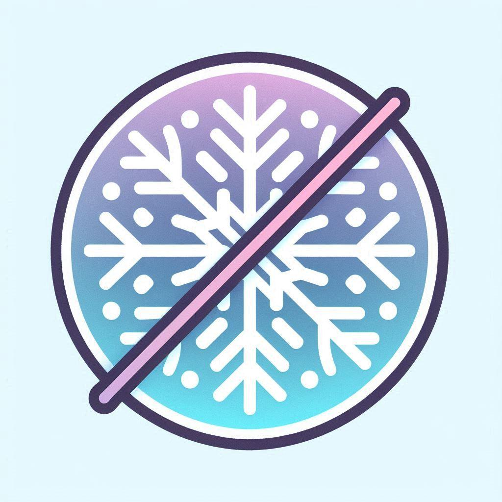

# wieder-nix


<div align="center">




</div>
Hello, I'm quite surprised you made it here. Well, this repo is just for my personal config. License is GPLv3. 

## Goals:
### Minimalstic mindset:
- only the stuff that I need
- no waybar, no fancy flexing command line tools like cmatirx, 
- just the stuff that I need: gaming, socialization (Vesktop, Signal), useful cli tools (tree, bat)
### Modularization:
- almost every feature has an easy enable option
- every enable option is found in configuration.nix
--> easily make new configurations without a hassle

## File Structure:
```tree
├── assets  - assets like pictures, scripts, etc
│ 
│── flake.lock
├── flake.nix       - entrypoint
├── hm              - home-manager modules
├── hosts           - host specific config
├── nix             - nixos specific modules
│   ├── essentials  - essential modules
│   ├── misc        - miscallanious modules, that don't have a specific theme
│   ├── nixvim      - nixvim modules
│   ├── services    - specific services
│   └── userspace   - modules that are user-specific
└── readme.md       - You're looking at it!  

```


### Issue Tracker:
    - config required for:
        - fuzzel
        - kitty
    - notification deamon with e.g. time shortcut
    - disko config


### Credit:
[refact0r/system24](https://github.com/refact0r/system24/tree/main) - Vesktop Theme
