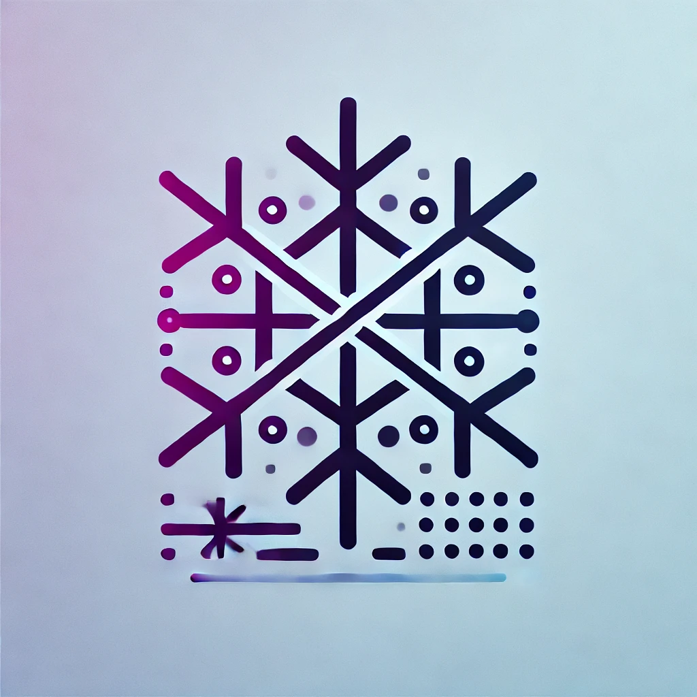

# wieder-nix


<div align="center">




</div>
Hello, I'm quite surprised you made it here. Well, this repo is just for my personal config. License is GPLv3. 
---

## Goals:
### Minimalstic mindset:
- only the stuff that I need
- no waybar, no fancy flexing command line tools like cmatirx, 
- just the stuff that I need: gaming, socialization (Vesktop, Signal), useful cli tools (tree, bat)
### Modularization:
- almost every feature has an easy enable option
- every enable option is found in configuration.nix
--> easily make new configurations without a hassle

P.S. If you find a bug, it’s probably not my fault... unless it is.
## File Structure:
FIXME: add files and descriptions
```tree
.
├── flake.lock
├── flake.nix  
│   --- The main entry point for the Nix flake configuration. Flakes make configurations cleaner and reusable!
├── hm  
│   --- Home-Manager-specific configurations, distinct from NixOS system-level files.
│   ├── default.nix --- Imports all files in the `hm` directory.
│   ├── fuzzel.nix  --- Home-manager configuration for Fuzzel.
│   ├── kitty.nix   --- Home-manager configuration for Kitty.  
│   └── niri.nix    --- Home-manager configuration for the Niri compositor.  
├── hosts  
│   --- Host-specific configurations, each containing:  
│   ├── configuration.nix           --- NixOS system configuration.
│   ├── hardware-configuration.nix  --- Auto-generated hardware settings for the host.
│   └── home.nix                    --- Home-Manager configuration specific to the host.  
├── nix  
│   --- Contains system-wide NixOS configurations, not related to Home-Manager:
│   ├── boot.nix        --- bootloader (e.g., GRUB).  
│   ├── browser.nix     --- Installs Firefox-based browsers. Suggestions welcome!  
│   ├── default.nix     --- Imports all files in this directory.  
│   ├── gaming.nix      --- Gaming configurations for Steam, Lutris, etc. Inspired by Vimjoyer.  
│   ├── git.nix         --- Git-specific settings.  
│   ├── greetd.nix      --- Sets up auto-login and auto-launch for the compositor.  
│   ├── localization.nix--- Timezone, keyboard layout, and localization settings.  
│   ├── misc.nix        --- Miscellaneous options like enabling flakes and unfree software.  
│   ├── niri.nix        --- Configuration for the Niri compositor.  
│   ├── nixvim          --- Nixvim configuration. Planning to switch to kickstart.nixvim for a cleaner setup.  
│   │   ├── keybinds.nix  
│   │   ├── nixvim.nix   
│   │   ├── options.nix  
│   │   └── plugins      --- Plugin configurations for Neovim. Includes:  
│   │       ├── cmp.nix  
│   │       ├── cmp-nvim.nix  
│   │       ├── default.nix  
│   │       ├── lsp.nix  
│   │       ├── luasnip.nix  
│   │       ├── telekasten.nix  
│   │       ├── telescope.nix  
│   │       └── vimtex.nix  
│   ├── no-shutdown.nix --- Disables the shutdown button (a safeguard).  
│   ├── socialize.nix   --- Installs apps for communication, e.g., Signal or Vesktop.  
│   ├── sound.nix       --- Audio settings.  
│   ├── terminal.nix    --- Terminal configuration and related utilities (e.g., `tree`).  
│   ├── users.nix       --- User account configurations (currently only `andi`).  
│   └── zfs.nix         --- ZFS-specific configurations (e.g., GRUB setup).  
└── README.md   --- You're looking at it!  

```


### Issue Tracker:
    - cross dependencies between /nix/niri.nix and /hm/niri.nix
    - config required for:
        - fuzzel
        - kitty
    - notification deamon with e.g. time shortcut
    - set stylix up
    - shutdown keybind
